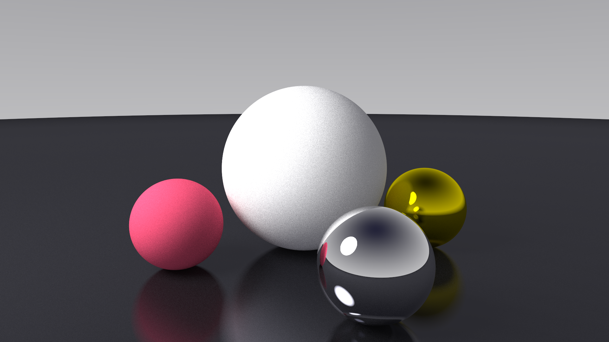

# RayTracingEngine

## 概要
レイトレース型3Dエンジンの核となる部分をC++で実装するプロジェクト。  
シンプルなレイトレーサーをベースに、カメラ・マテリアル・光源・シーン管理など
3Dエンジンの基礎的な機能を段階的に構築する。

## 目的
本プロジェクトの目的は以下の通り。

- レイトレーシングアルゴリズムの理解
- 3次元ベクトル計算や幾何処理の実装
- レンダリングパイプラインの基礎理解
- C++による中規模ソフトウェア開発の経験
- 将来的なリアルタイム3Dエンジン開発の基盤構築

## 動作環境
* OS: Windows11
* コンパイラ: GCC 15.2.0 (MinGW, x86_64-win32-seh)
* C++規格: C++23

## 実装手順

主要な実装手順をここに記録する。

### 1. 動作環境及びプロジェクトのセットアップ
* **目的:** プロジェクトの開発フローを明確にする。
* **開発環境:**
  * OS: Windows 11
  * コンパイラ: GCC 15.2.0 (MinGW, x86_64-win32-seh)
  * C++規格: C++23
  * IDE: Antigravity
  * ライブラリ: SDL3, Dear ImGui
  * バージョン管理: Git
* **開発フロー:**
  1. 数学ライブラリの作成
  2. カメラ基盤の構築とRay生成テスト
  3. 物体オブジェクトの実装
  4. レンダリングの実装
  5. レンダリングの最適化
  6. GUI統合
  7. 最終調整・デバッグ
---

### 1. 数学ライブラリの作成
* **目的:** レイトレーシングシステム全体で使用する基礎的な数学演算を定義する
* **作業内容:**
  * 3次元ベクトルクラス（`Vec3`）の実装：四則演算、内積、外積、正規化
  * 光線クラス（`Ray`）の実装：原点と方向ベクトル
  * 乱数生成機能や数学ユーティリティ関数の実装
* **主要な変更ファイル:**
  * `vec3.hpp`
  * `ray.hpp`
  * `math_utils.hpp`
* **備考・課題:**
  * 数学処理はレンダラーのパフォーマンスに直結するため、適切に `inline` 化するなどの工夫を行った。
  * `vec3.hpp`では純粋なベクトル演算のみを実装しており、ゼロ除算のチェックやエラー処理は呼び出し側で自由に制御できるようにした。
  * コンパイルエラーや単体テストで計算の正確性を担保してから次のステップに進めた。

---

### 2. カメラ基盤とシーンの構築
* **目的:** シーン内に仮想的なカメラと、複数のオブジェクト・マテリアルを配置・管理する仕組みを整える。
* **作業内容:**
  * カメラ座標系の構築と、フォーカス距離や視野角を考慮した光線生成ロジックの実装。
  * 背景色、平行光源の向き、マテリアルリスト、配置オブジェクトを一元管理し、最近接オブジェクトとの交差判定を一括して行う`Scene`クラスの実装。
* **主要な変更ファイル:**
  * `camera.hpp`
  * `scene.hpp`, `scene.cpp`
* **備考・課題:**
  * `Camera`にApertureやFocus Distanceの概念を取り入れ、被写界深度表現の基盤も用意した。
  * `Scene`のオブジェクト管理に `std::unique_ptr`を用いてメモリ安全性を確保した一方で、交差判定が全オブジェクトに対する線形探索となっている。そのため、オブジェクトが増えれば増えるほど処理が重くなってしまうのが課題となる。
---

### 3. 物体オブジェクトの実装
* **目的:** 光線（レイ）との交差判定を行うための物体の基底インターフェースと、具体的な形状（球体）、および物体の表面の質感を表現するマテリアルの仕組みを実装する。
* **作業内容:**
  * 光線との交点座標、法線ベクトル、マテリアルIDなどを記録する `HitRecord` 構造体と、純粋仮想関数 `hit` を持つ全オブジェクトの基底クラス `Object` の定義。
  * `Object` クラスを継承した `Sphere`（球体）クラスの作成と、二次方程式を用いて光線と球体の交差判定を行うロジックの実装。
  * 色、金属度（`metallic`）、粗さ（`roughness`）などのパラメータを持ち、光の散乱・反射方向を計算する `Material` 構造体の実装。また、鏡、ガラス、金などの一般的な材質を簡単に生成するためのヘルパー関数（静的メソッド）の用意。
* **主要な変更ファイル:**
  * `object.hpp`
  * `sphere.hpp`, `sphere.cpp`
  * `material.hpp`
* **備考・課題:**
  * `Sphere::hit` での交差判定は、二次方程式の判別式を利用して交点の有無をチェックし、有効な範囲（`t_min` から `t_max`）内で最も手前にある交点を計算している。
  * `Material` 構造体には透過率（`transmission`）や屈折率（`ior`）のプロパティが用意されているものの、現在の `scatter` メソッドの内部ロジックは主に拡散反射と鏡面反射で止めているので、ガラスなどの屈折を伴う透過表現の処理は今後の実装課題となっている。

---

### 4. レンダリングの実装
* **目的:** カメラからシーンに向けて光線を飛ばし、オブジェクトとの交差判定やマテリアルの計算を行って、最終的な画像データ（ピクセル配列）を生成する仕組みを構築する。
* **作業内容:**
  * 画像サイズ、ピクセルごとのサンプル数（`samples_per_pixel`）、最大反射回数（`max_depth`）を保持し、ピクセルデータを一元管理する `Renderer` クラスを実装した。
  * ピクセル内でグリッド状に分割し、ランダムなオフセットを加えて複数の光線を飛ばすことで、ジャギーを軽減するアンチエイリアシング処理を実装した。
  * 再帰的に光線を追跡（`trace_ray`）し、オブジェクトとの交差時の計算や、交差しなかった場合の背景色の描画を行うロジックを実装した。
  * 色情報の平均化処理、ガンマ補正、および計算結果を32ビット整数のピクセルデータに変換する処理（`to_color32`）を実装した。
* **主要な変更ファイル:**
  * `renderer.hpp`
  * `renderer.cpp`
* **備考・課題:**
  * アンチエイリアス処理において、サンプル数の平方根を取ってグリッドを計算しているため、`samples_per_pixel` には平方数を指定することを前提とした実装となっている。
  * `trace_ray` メソッドが再帰呼び出しを行っているため、`max_depth` の値や画像の解像度、サンプル数が増大するほど計算負荷が指数関数的に高くなるのが課題である。

---

### 5-1. レンダリングの最適化(並列処理化)
* **目的:** レンダリング処理は本質的に独立した計算の集合であり、CPUコアを有効活用することで処理時間を大幅に短縮できる。ここではマルチスレッド化による並列処理でパフォーマンスを改善し、将来的なGPU移行の土台を作ることを目的とする。
* **作業内容:**
  - `renderer.cpp` 内の画素ループ（通常は画像の縦方向ループ）の前に OpenMP ディレクティブを追加して並列化する。
  - `schedule(dynamic)` を指定することで、各スレッドに配分する行数を動的に割り当て、レイ反射回数などで処理時間にばらつきがある場合でも負荷分散を改善する。
* **主要な変更ファイル:**
  - `renderer.cpp`
* **備考・課題:**
  - コンパイル時に OpenMP を有効化する必要がある。CMake を利用している場合は `find_package(OpenMP)` とターゲットにフラグを付与する。
  - ループ内で使う乱数生成がスレッドセーフでない場合、競合や性能低下を招く可能性がある。
  
#### レンダリング結果

* **出力条件:** 画像解像度 1920 x 1080、ピクセルごとのサンプル数 1089、最大反射回数 10
* 並列処理化の前後で出力されるピクセルの色に計算ズレや欠損がないことを確認済み。

**実行時間の比較**
* **測定環境:** Intel Core i7-1255U 

| 実行条件 | レンダリング時間 | 備考 |
| :--- | :--- | :--- |
| シングルスレッド | 約 6816.81 秒 | OpenMP適用前 |
| マルチスレッド | 約 1326.17  秒 | OpenMP適用後  |

**考察**
* OpenMPによるマルチスレッド化を導入したことで、シングルスレッド時と比較して約 **5.1倍** の高速化を達成した。
* レンダリング中はCPUの全スレッドが高い使用率を維持していることが確認できた。
* ループのスケジューリングに `dynamic` を採用したことで、画像の複雑な部分と単純な部分の負荷が各スレッドへ動的に割り当てられ、無駄な待機時間を減らして効率的に計算リソースを使い切ることができたと考えられる。
---