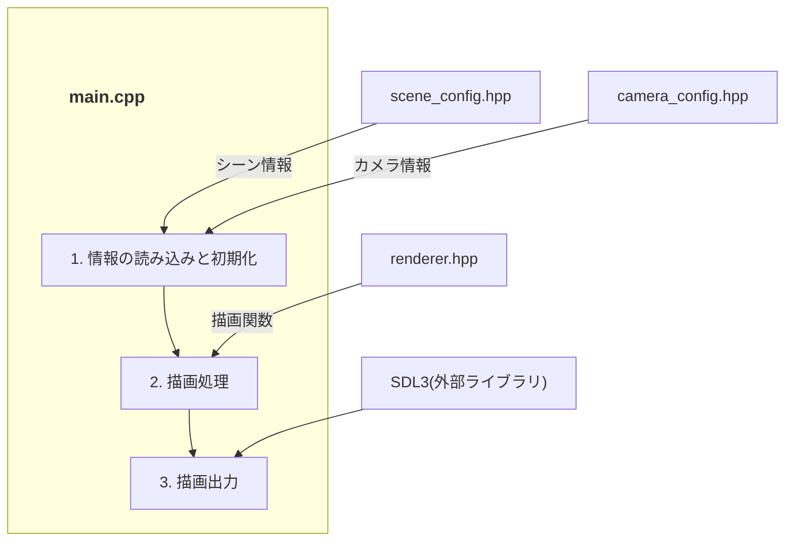

# システムアーキテクチャ 

このドキュメントでは、本プロジェクトの全体構造、使用技術、およびディレクトリ構成について記述します。

## 1. システム全体図
システムの全体像と、各コンポーネント間の相互作用です。



## 2. 技術スタック 


## 3. ディレクトリ構成
プロジェクトの主要なディレクトリ構造とその役割です。
```text

src/
├── main/
│   ├── main.cpp                # エントリーポイント
│   └── config/
│       ├── scene_config.hpp    # シーン設定
│       └── camera_config.hpp   # カメラ設定
```

