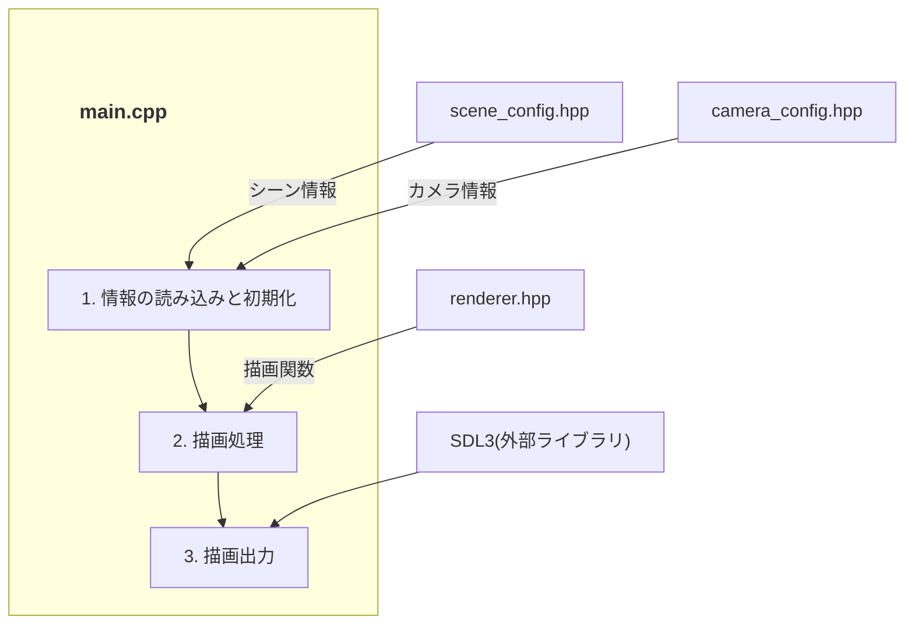
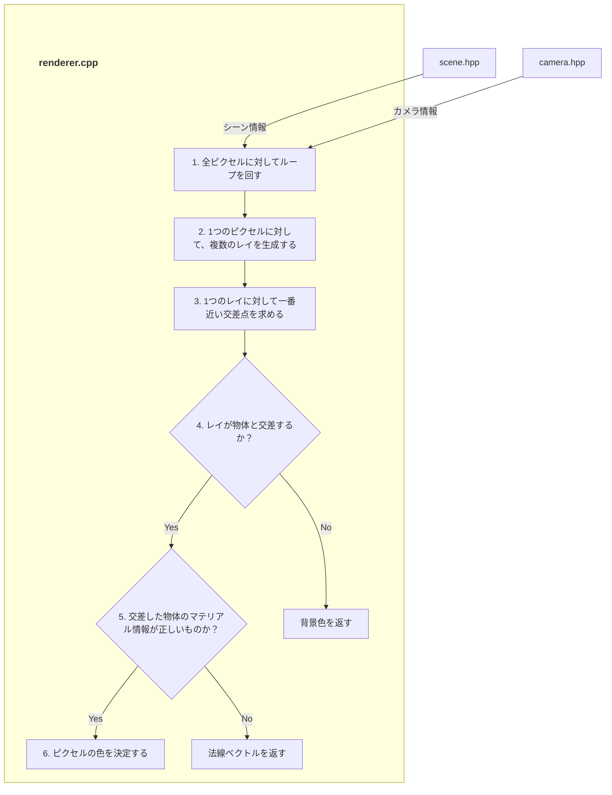
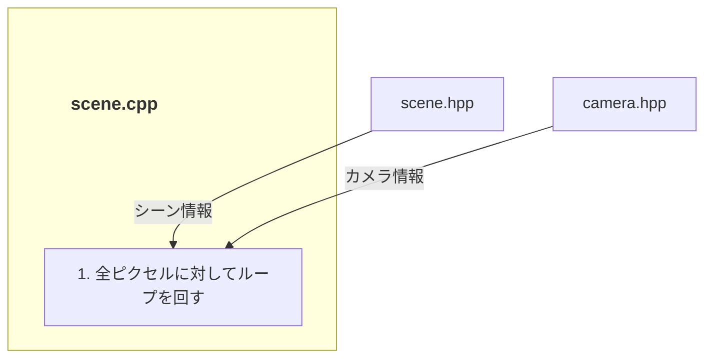

# システムアーキテクチャ 

このドキュメントでは、本プロジェクトの全体構造、使用技術、およびディレクトリ構成について記述します。

## 1. システム全体図
システムの全体像と、主要ファイルの役割を以下に示します。

### 1.1 main.cppの役割
`main.cpp`は、事前定義しておいた`config`を読み込み、`renderer`に橋渡しし描画を行う役割を担っています。なお、`renderer`で計算されたピクセル情報を`SDL3(外部ライブラリ)`に渡すことで、最終的な描画出力を行っています。以下の図は、`main.cpp`がどのように他のコンポーネントと連携しているかを示しています。



### 1.2 renderer.cppの役割
`renderer.cpp`は、シーン情報とカメラ情報に基づいてレンダリング処理を実行し、ピクセル情報を生成する役割を担っています。以下の図は、`renderer.cpp`がどのように他のコンポーネントと連携しているかを示しています。


### 1.3 scene.cppの役割
`scene.cpp`は、シーンの情報を管理し、レンダリングに必要なデータを提供する役割を担っています。以下の図は、`scene.cpp`がどのように他のコンポーネントと連携しているかを示しています。


### 1.4 bsdf.cppの役割
### 1.5 pbr_bsdf.cppの役割
## 2. 技術スタック 


## 3. ディレクトリ構成
プロジェクトの主要なディレクトリ構造とその役割です。
```text

src/
├── main/
│   ├── main.cpp                # エントリーポイント
│   └── config/
│       ├── scene_config.hpp    # シーン設定
│       └── camera_config.hpp   # カメラ設定
```

