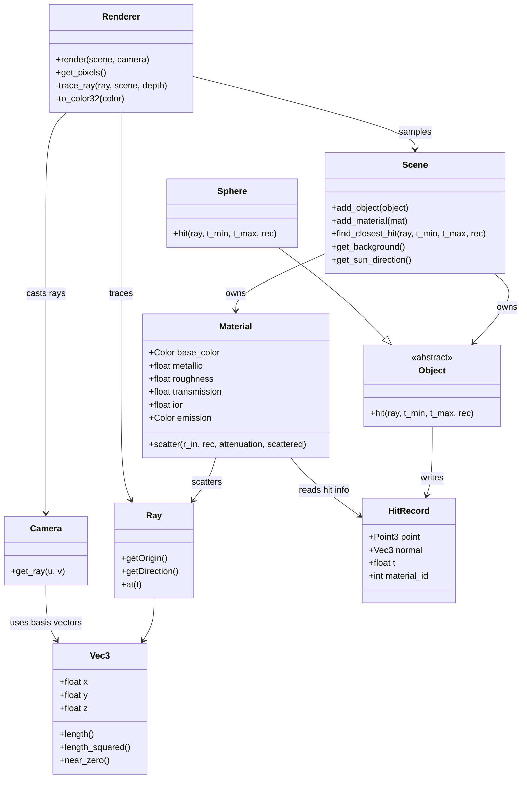

# Architecture Overview

このリポジトリは、SDL3 でのリアルタイム表示ループを入口に、CPU パストレーシングを実行する学習向けレイトレーシングエンジンです。

## モジュール一覧と役割

- src/main/main.cpp: SDL 初期化、イベントループ、カメラ移動入力、レンダリング再実行トリガ、PPM保存を管理。
- src/main/config/camera_config.hpp: カメラ位置・視点・FOV・絞り・移動速度と Camera 生成ロジック。
- src/main/config/scene_config.hpp: シーン構築（背景、太陽光、マテリアル、球体オブジェクト配置）。
- src/renderer/renderer.{hpp,cpp}: ピクセル走査、サンプリング、OpenMP 並列化、再帰的な trace_ray による色計算。
- src/scene/scene.{hpp,cpp}: Object 群と Material 群の保持、最短交差判定、環境光/太陽光パラメータ提供。
- src/scene/camera.hpp: レンズ半径と焦点距離を使ったレイ生成（被写界深度対応）。
- src/object/object.hpp: 交差判定インターフェースと HitRecord の定義。
- src/object/sphere.{hpp,cpp}: 球体のレイ交差判定を実装。
- src/material/material.hpp: 拡散/金属/透過（屈折）散乱と発光、簡易 Fresnel 反射率。
- src/math/{vec3,ray,math_utils}.hpp: ベクトル演算、Ray、乱数とサンプリング補助。

## 設計原則

- 責務分離: math / object / material / scene / renderer / main-config を分離し、学習しやすい最小単位で拡張可能にする。
- 描画モデル: 1ピクセルあたり複数サンプルを取り、trace_ray の再帰で間接光を近似する CPU パストレーシング。
- 対話性: 入力があった時のみ再レンダリングするフラグ駆動ループで、操作感と処理負荷のバランスを取る。
- 実用速度: OpenMP schedule(dynamic) による scanline 並列化を採用。

## クラス図（概要）

