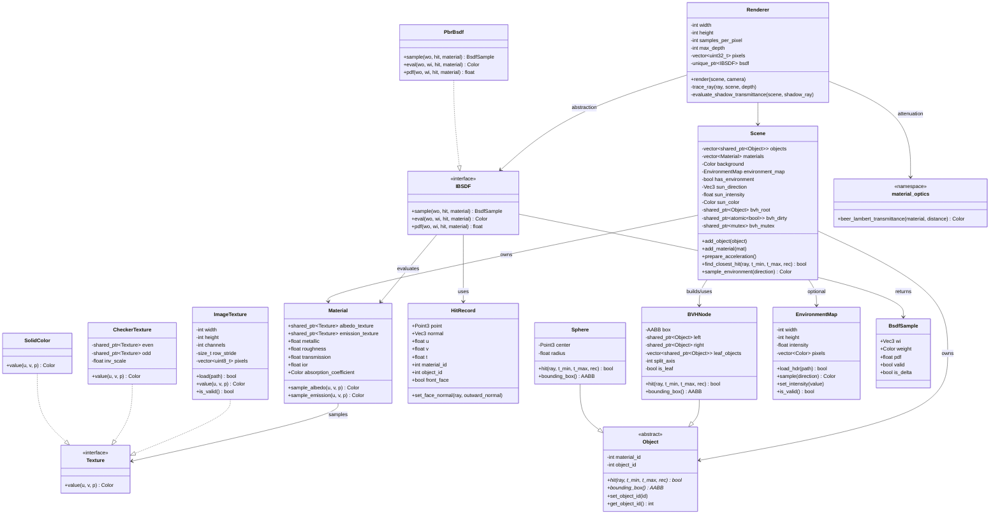

# クラス図

ポイント:

- `Scene` は `bvh_dirty`（atomic）と `bvh_mutex` で BVH の遅延再構築を制御します。
- `HitRecord` には `u/v/object_id/front_face` が入り、BSDF と透過影処理で利用されます。
- `Material` は常にテクスチャ経由で色を取得し、BRDF/BTDF の評価責務は `IBSDF` 側にあります。