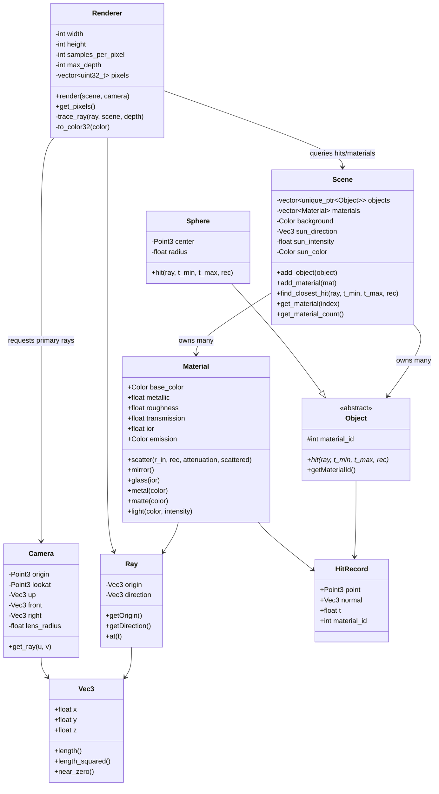

# クラス図（詳細）

レイトレーシングエンジンの主要クラス構成。

```mermaid
classDiagram
    class Vec3 {
        +float x
        +float y
        +float z
        +length()
        +length_squared()
        +near_zero()
    }

    class Ray {
        -Vec3 origin
        -Vec3 direction
        +getOrigin()
        +getDirection()
        +at(t)
    }

    class Camera {
        -Point3 origin
        -Point3 lookat
        -Vec3 up
        -Vec3 front
        -Vec3 right
        -float lens_radius
        +get_ray(u, v)
    }

    class HitRecord {
        +Point3 point
        +Vec3 normal
        +float t
        +int material_id
    }

    class Object {
        <<abstract>>
        #int material_id
        +hit(ray, t_min, t_max, rec)*
        +getMaterialId()
    }

    class Sphere {
        -Point3 center
        -float radius
        +hit(ray, t_min, t_max, rec)
    }

    class Material {
        +Color base_color
        +float metallic
        +float roughness
        +float transmission
        +float ior
        +Color emission
        +scatter(r_in, rec, attenuation, scattered)
        +mirror()
        +glass(ior)
        +metal(color)
        +matte(color)
        +light(color, intensity)
    }

    class Scene {
        -vector~unique_ptr~Object~~ objects
        -vector~Material~ materials
        -Color background
        -Vec3 sun_direction
        -float sun_intensity
        -Color sun_color
        +add_object(object)
        +add_material(mat)
        +find_closest_hit(ray, t_min, t_max, rec)
        +get_material(index)
        +get_material_count()
    }

    class Renderer {
        -int width
        -int height
        -int samples_per_pixel
        -int max_depth
        -vector~uint32_t~ pixels
        +render(scene, camera)
        +get_pixels()
        -trace_ray(ray, scene, depth)
        -to_color32(color)
    }

    Sphere --|> Object
    Scene --> Object : owns many
    Scene --> Material : owns many
    Renderer --> Scene : queries hits/materials
    Renderer --> Camera : requests primary rays
    Renderer --> Ray
    Material --> HitRecord
    Material --> Ray
    Object --> HitRecord
    Camera --> Vec3
    Ray --> Vec3
```

図は docs/architecture.md と整合しています。