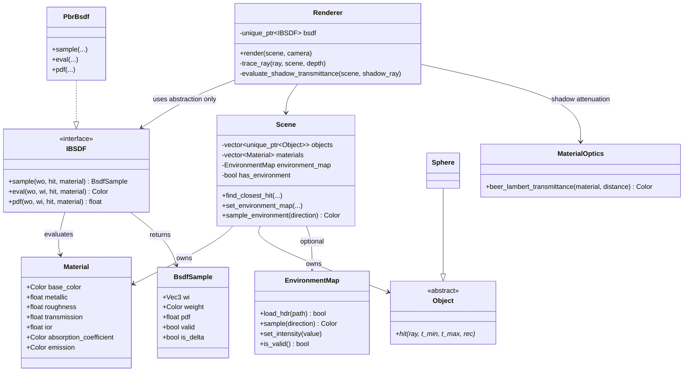

# クラス図

```mermaid
classDiagram
    class Material {
        +Color base_color
        +float metallic
        +float roughness
        +float transmission
        +float ior
        +Color absorption_coefficient
        +Color emission
    }

    class EnvironmentMap {
        +load_hdr(path) bool
        +sample(direction) Color
        +set_intensity(value)
        +is_valid() bool
    }

    class BsdfSample {
        +Vec3 wi
        +Color weight
        +float pdf
        +bool valid
        +bool is_delta
    }

    class IBSDF {
        <<interface>>
        +sample(wo, hit, material) BsdfSample
        +eval(wo, wi, hit, material) Color
        +pdf(wo, wi, hit, material) float
    }

    class PbrBsdf {
        +sample(...)
        +eval(...)
        +pdf(...)
    }

    class Scene {
        -vector~unique_ptr~Object~~ objects
        -vector~Material~ materials
        -EnvironmentMap environment_map
        -bool has_environment
        +find_closest_hit(...)
        +set_environment_map(...)
        +sample_environment(direction) Color
    }

    class Renderer {
        -unique_ptr~IBSDF~ bsdf
        +render(scene, camera)
        -trace_ray(ray, scene, depth)
        -evaluate_shadow_transmittance(scene, shadow_ray)
    }

    class Object {
        <<abstract>>
        +hit(ray, t_min, t_max, rec)*
    }

    class Sphere

    class MaterialOptics {
        +beer_lambert_transmittance(material, distance) Color
    }

    PbrBsdf ..|> IBSDF
    Renderer --> IBSDF : uses abstraction only
    Renderer --> Scene
    Scene --> Material : owns
    Scene --> Object : owns
    Scene --> EnvironmentMap : optional
    Sphere --|> Object
    IBSDF --> Material : evaluates
    IBSDF --> BsdfSample : returns
    Renderer --> MaterialOptics : shadow attenuation
```

ポイント:

- `Renderer` は `IBSDF` と `Scene` にだけ依存し、散乱の具体実装詳細を持ちません。
- 環境光は `Scene::sample_environment` に隠蔽され、背景色と HDRI の切り替えが同一 API で扱えます。