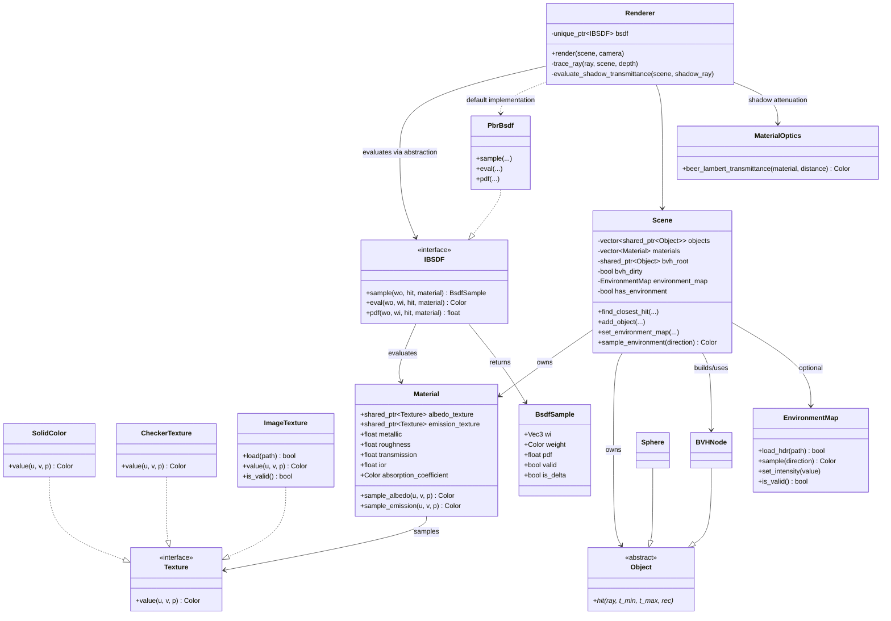

# クラス図

ポイント:

- `Renderer` の散乱評価は `IBSDF` 経由で実行され、既定実装として `PbrBsdf` を使用できます。
- `Scene` は `Object` を `shared_ptr` で保持し、BVH ノードから同じプリミティブを参照します。
- `Material` はテクスチャをサンプリングし、散乱評価は `IBSDF` 実装側に委譲します。
- 環境光は `Scene::sample_environment` に隠蔽され、背景色と HDRI の切り替えが同一 API で扱えます。