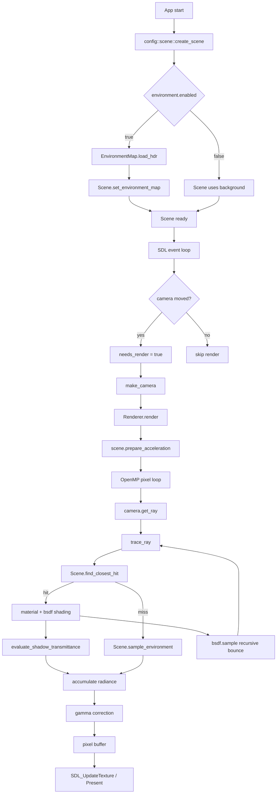

# Data Flow

現行実装の主経路（初期化 -> イベントループ -> レンダリング -> 表示）を示します。

## 初期化フェーズ

- `config::scene::create_scene()` で以下を設定:
    - `Material` 配列（ground / brushed_metal / glass / red_matte）
    - `Sphere` 群（既定は benchmark グリッド）
    - 太陽光（direction / intensity / color）
    - `config::environment::enabled == true` の場合は `EnvironmentMap::load_hdr`
- `Renderer(width=800, height=600, samples=100, max_depth=10)` を生成

## フレーム更新フェーズ

- SDL 入力でカメラ値を更新
- 移動があったときだけ `needs_render = true`
- `needs_render` のときのみ `Renderer::render(scene, camera)` を実行

## レンダリングフェーズ

- `render` 開始時に `scene.prepare_acceleration()`
- OpenMP で画素ループし、各サンプルで `camera.get_ray(u, v)` を生成
- `trace_ray(ray, scene, depth)` を再帰実行

### trace_ray の hit 経路

- `scene.find_closest_hit` で交差検索（必要時 BVH を遅延構築）
- `material_id` が有効なら:
    - `mat.sample_emission(rec.u, rec.v, rec.point)`
    - 直達光: `bsdf.eval` + `evaluate_shadow_transmittance`
    - 間接光: `bsdf.sample` で次方向を生成し再帰
    - 屈折体内部区間（`!rec.front_face && mat.transmission > 0`）は Beer-Lambert を適用
- `material_id` が不正な場合は法線可視化色を返す

### trace_ray の miss 経路

- `scene.sample_environment(ray.getDirection())`
    - HDRI 有効時: `EnvironmentMap::sample`
    - 無効時: `Scene::background`

## 出力フェーズ

- サンプル平均後にガンマ補正（`sqrt`）
- `ARGB8888` にパックして `pixels` へ格納
- `SDL_UpdateTexture` -> `SDL_RenderTexture` -> `SDL_RenderPresent`

補足:

- 影透過は `active_media[object_id]` で入射/出射を追跡し、厚みベース減衰を計算します。
- `bsdf.pdf` は重み計算に使われ、将来 MIS 拡張時の基盤になります。