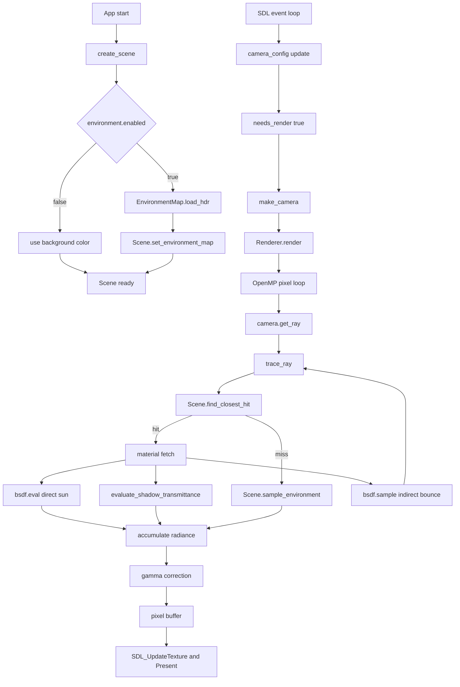

# Data Flow

現在実装されている主経路（初期化 -> レンダリング -> 表示）を示します。

- 初期化:
    - `config::scene::create_scene()` がマテリアル・オブジェクト・太陽光を設定
    - `environment.enabled == true` の場合に HDRI をロード
- レンダリング:
    - `Renderer::render(scene, camera)` が OpenMP で画素ループ
    - 1 サンプルごとに `trace_ray` を再帰実行
- hit 時:
    - `bsdf.eval` で直達太陽光
    - `evaluate_shadow_transmittance` で Beer-Lambert 減衰
    - `bsdf.sample` で次方向を生成して再帰
- miss 時:
    - `Scene::sample_environment(direction)` を呼び、HDRI または背景色を返す
- 出力:
    - ガンマ補正後に SDL テクスチャへ転送

補足:

- `bsdf.pdf` は現在 `sample` 内の重み計算に利用され、将来の MIS 拡張にも使える形になっています。