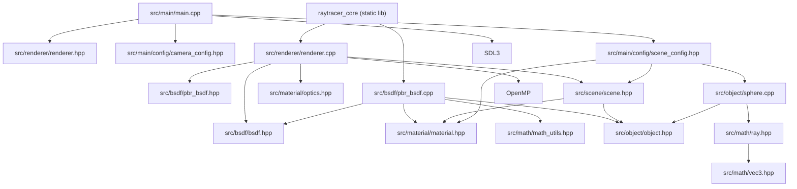

# モジュール依存関係

BSDF 導入後の依存関係（依存逆転を反映）です。

- 重要: `Renderer` は抽象 `IBSDF` に依存し、`Material` 実装詳細や散乱分岐ロジックを持たない。
- `PbrBsdf` は `Material` パラメータを解釈するが、シーン管理や描画ループを知らない。
- Beer-Lambert は `material/optics.hpp` に分離し、`Renderer` は光学関数を呼ぶだけに限定している。
- `raytracer_core` ライブラリ化により、将来のテスト実行バイナリで同じコアを再利用できる。
