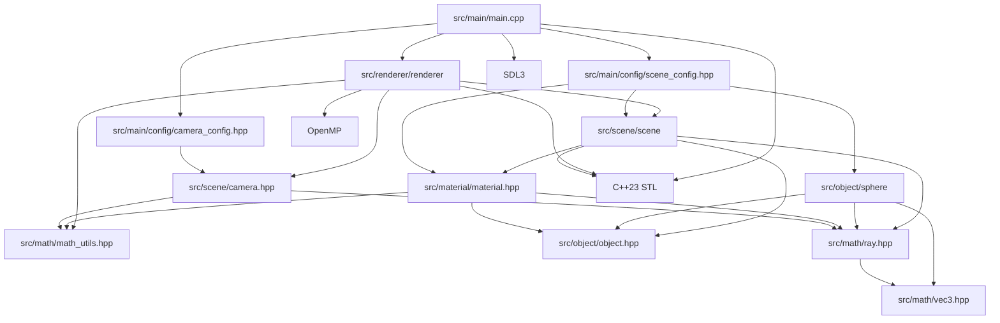

# モジュール依存関係

プロジェクト内部のモジュール依存を示します。

- 循環依存はない。主経路は main.cpp → renderer → scene/object/material/math。
- 設定ヘッダは main から参照される境界層で、レンダラー本体への依存は持たない。
- OpenMP 依存は renderer.cpp に閉じ込められており、他モジュールは並列化手法から独立している。
