# モジュール依存関係

現行コードに合わせた依存関係です。

```mermaid
graph TD
    main_cpp["src/main/main.cpp"] --> renderer_hpp["src/renderer/renderer.hpp"]
    main_cpp --> camera_cfg["src/main/config/camera_config.hpp"]
    main_cpp --> scene_cfg["src/main/config/scene_config.hpp"]

    camera_cfg --> camera_hpp["src/scene/camera.hpp"]
    scene_cfg --> scene_hpp["src/scene/scene.hpp"]
    scene_cfg --> material_hpp["src/material/material.hpp"]
    scene_cfg --> texture_hpp["src/material/texture.hpp"]
    scene_cfg --> sphere_hpp["src/object/sphere.hpp"]
    scene_cfg --> env_hpp["src/environment/environment_map.hpp"]

    renderer_cpp["src/renderer/renderer.cpp"] --> renderer_hpp
    renderer_cpp --> bsdf_if["src/bsdf/bsdf.hpp"]
    renderer_cpp --> pbr_bsdf_hpp["src/bsdf/pbr_bsdf.hpp"]
    renderer_cpp --> scene_hpp
    renderer_cpp --> optics_hpp["src/material/optics.hpp"]
    renderer_cpp --> math_utils["src/math/math_utils.hpp"]

    pbr_bsdf_cpp["src/bsdf/pbr_bsdf.cpp"] --> pbr_bsdf_hpp
    pbr_bsdf_cpp --> bsdf_if
    pbr_bsdf_cpp --> material_hpp
    pbr_bsdf_cpp --> object_hpp["src/object/object.hpp"]
    pbr_bsdf_cpp --> math_utils

    material_hpp --> texture_hpp
    texture_cpp["src/material/texture.cpp"] --> texture_hpp

    scene_cpp["src/scene/scene.cpp"] --> scene_hpp
    scene_cpp --> bvh_hpp["src/object/bvh.hpp"]
    scene_hpp --> object_hpp
    scene_hpp --> material_hpp
    scene_hpp --> env_hpp

    bvh_cpp["src/object/bvh.cpp"] --> bvh_hpp
    bvh_hpp --> object_hpp
    bvh_hpp --> aabb_hpp["src/object/aabb.hpp"]

    sphere_cpp["src/object/sphere.cpp"] --> sphere_hpp
    sphere_hpp --> object_hpp

    env_cpp["src/environment/environment_map.cpp"] --> env_hpp
    env_cpp --> vec3_hpp["src/math/vec3.hpp"]

    object_hpp --> ray_hpp["src/math/ray.hpp"]
    ray_hpp --> vec3_hpp
    camera_hpp --> ray_hpp
    camera_hpp --> math_utils

    %% build/runtime dependencies
    sdl3["SDL3"]
    openmp["OpenMP"]
    core["raytracer_core (static lib)"]
    app["raytracer (executable)"]

    core --> renderer_cpp
    core --> pbr_bsdf_cpp
    core --> scene_cpp
    core --> bvh_cpp
    core --> env_cpp
    app --> core
    app --> main_cpp
    app --> sdl3
    renderer_cpp --> openmp
```

要点:

- `Renderer` は `IBSDF` 抽象に依存し、具象は `PbrBsdf` が既定です。
- `Scene` は `EnvironmentMap` を内包し、miss 時の環境取得 API を一元化しています。
- `raytracer_core` / `raytracer` 分離により、将来のテスト追加時にコア再利用がしやすい構成です。
