# モジュール依存関係

現在のコードに合わせた依存関係です。

```mermaid
graph TD
    main_cpp["src/main/main.cpp"] --> renderer_hpp["src/renderer/renderer.hpp"]
    main_cpp --> camera_cfg["src/main/config/camera_config.hpp"]
    main_cpp --> scene_cfg["src/main/config/scene_config.hpp"]

    scene_cfg --> scene_mod["src/scene/scene.hpp"]
    scene_cfg --> material_mod["src/material/material.hpp"]
    scene_cfg --> texture_mod["src/material/texture.hpp"]
    scene_cfg --> sphere_hpp["src/object/sphere.hpp"]
    scene_cfg --> env_hpp["src/environment/environment_map.hpp"]

    renderer_cpp["src/renderer/renderer.cpp"] --> bsdf_if["src/bsdf/bsdf.hpp"]
    renderer_cpp --> bsdf_impl["src/bsdf/pbr_bsdf.hpp"]
    renderer_cpp --> scene_mod
    renderer_cpp --> optics_mod["src/material/optics.hpp"]
    renderer_cpp --> math_utils["src/math/math_utils.hpp"]

    bsdf_impl_cpp["src/bsdf/pbr_bsdf.cpp"] --> bsdf_if
    bsdf_impl_cpp --> material_mod
    bsdf_impl_cpp --> object_abs["src/object/object.hpp"]
    bsdf_impl_cpp --> math_utils

    material_mod --> texture_mod
    texture_cpp["src/material/texture.cpp"] --> texture_mod

    scene_cpp["src/scene/scene.cpp"] --> scene_mod
    scene_cpp --> bvh_hpp["src/object/bvh.hpp"]
    scene_mod --> object_abs
    scene_mod --> material_mod
    scene_mod --> env_hpp

    bvh_cpp["src/object/bvh.cpp"] --> bvh_hpp
    bvh_hpp --> object_abs
    bvh_hpp --> aabb_hpp["src/object/aabb.hpp"]

    env_cpp["src/environment/environment_map.cpp"] --> env_hpp
    env_cpp --> vec3_mod["src/math/vec3.hpp"]

    sphere_cpp["src/object/sphere.cpp"] --> sphere_hpp
    sphere_hpp --> object_abs
    object_abs --> ray_mod["src/math/ray.hpp"]
    ray_mod --> vec3_mod

    %% External and build targets
    sdl3["SDL3"]
    openmp["OpenMP"]
    core["raytracer_core (static lib)"]
    app["raytracer (executable)"]

    main_cpp --> sdl3
    renderer_cpp --> openmp
    core --> renderer_cpp
    core --> bsdf_impl_cpp
    core --> env_cpp
    app --> core
```

要点:

- `Renderer` の評価経路は `IBSDF` 抽象に依存しつつ、既定実装として `PbrBsdf` を生成可能です。
- `Scene` は `find_closest_hit` 内で BVH を遅延構築して利用し、交差探索コストを抑えています。
- `Scene` が `EnvironmentMap` を内包するため、miss 時の環境サンプリングは `Scene` 側へ集約されています。
- CMake は `raytracer_core` と `raytracer` を分離しており、将来テスト追加時にコア再利用が容易です。
